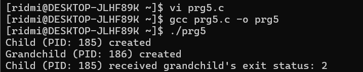

| code file | output |
|-----------|--------|
|['prg_1.c'](./Codes/prg_1.c)||
|['prg_2.c'](./Codes/prg_2.c)||
|['prg_3.c'](./Codes/prg_3.c)||
|['prg4.c'](./Codes/prg4.c)||
|['prg5.c'](./Codes/prg5.c)|| 
